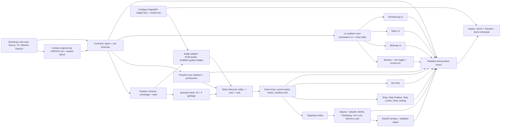

# LeetCode 99

Tetris 99 / battle-royale party game, but players race to solve bite-sized LeetCode-style problems.

## TL;DR

- Players join a lobby (2–8 real players + bots for demo).
- Everyone receives a stream of short **function-only Python** problems.
- Unsolved problems accumulate in a **stack**. If your stack overflows, you’re eliminated.
- Clearing problems scores points and **auto-attacks** your target (Tetris 99 targeting).
- Winner is **last player standing**. If time expires: highest `score` wins (tie-break by lowest `stackSize`, then stable by `playerId`).

## Goals / Non-goals

### Goals (Hackathon)

- A deployable web game with a real multiplayer feel.
- Tight, fast-paced loop: read → code → run → submit → attack.
- Memorable “riced workstation” identity (game UI, not generic SaaS).
- MVP Battle Royale mode that’s fun with 2–8 players.

### Non-goals (MVP)

- Anti-cheat, plagiarism detection.
- Supporting many languages.
- Fully-featured question generation pipeline.
- Pair programming (can be post-MVP).
- Perfect balance (good-enough game feel for demo).

## Audience

- Internal: teammates + AI coding agents (to align on scope, interfaces, and ownership).
- External (demo): hackathon judges + walk-up participants.

## Core Gameplay Hook

### Lobby

- 2 to 99 player rooms (MVP: 2–8 + bots).
- Lobby-only chat (players + spectators) for coordination; system messages for join/leave, bots added, and host transfer.
- Configurable:
  - Total match time (default 10 minutes; configurable 6–10 minutes)
  - Question difficulty profile (Beginner / Moderate / Competitive)
  - Attack intensity (Low/High)

### Match Loop (Battle Royale)

Mental model:

```text
┌─────────────────┐
│ CURRENT PROBLEM │  ← Active in editor (not counted in stackSize)
├─────────────────┤
│ Stack[0] (top)  │  ← Next problem after solve/discard
│ Stack[1]        │
│ ...             │
└─────────────────┘
```

1. You start with a **current problem** (active) plus **2 queued problems** in your stack (queued-only; current is not counted in `stackSize`).
2. New problems arrive every `T` seconds; each player draws independently from the question bank. New arrivals are pushed onto the **top** of your stack (they never interrupt your current editor). MVP sampling: avoid repeating a problem for the same player until the bank is exhausted; repeats are allowed after.
3. When you `SUBMIT_CODE`:
   - If the submission fails: your **streak resets**.
   - If the submission passes and the problem is **garbage**: you get **0 points** and send **no attack**.
   - If the submission passes and the problem is **non-garbage**: you gain points and send an attack to your current target.
   - On any passing submit (garbage or not), you advance: draw the next problem by popping the top of your stack (if empty, the server draws a fresh problem).
4. If `stackSize > STACK_LIMIT` (queued only; current excluded), you are eliminated (die on the `STACK_LIMIT + 1`th queued insert).
5. Last player alive wins. If time expires, highest `score` wins (tie-break by lowest `stackSize`, then stable by `playerId`).

### Scoring (MVP)

- Easy: +5
- Medium: +10
- Hard: +20
- Garbage micro-problems: **0 points**

## Questions

### Requirements

Problems must be:

- Fast to understand (<30s read time)
- Fast to implement (ideally 1–5 minutes)
- Not too much boilerplate
- Function-only (LeetCode style)

### Format (Function-only Python)

Each question defines:

- `title`
- `prompt` (short)
- `functionName`
- `signature` (Python)
- `starterCode` (includes signature and docstring)
- `publicTests` (visible)
- `hiddenTests` (server-side only; recommended 2–5 cases; used on Submit)
- `timeLimitMs` (per submission)
- `isGarbage` (optional boolean; default false)

**MVP rule**

- `RUN_CODE` runs `publicTests` only
- `SUBMIT_CODE` runs `publicTests + hiddenTests`, awards points, and triggers attacks (non-garbage only)

Example signature:

```python
def two_sum(nums: list[int], target: int) -> list[int]:
    ...
```

### Difficulty Ramp (Pacing)

- Phase 1: Warmup / tutorial-ish
  - tiny tasks: palindrome check, counts, simple loops
  - “fix the code” tasks (starter code mostly complete)
- Phase 2: Easy → medium
  - classic patterns: hashmap, two pointers, stack, BFS on small graphs
- Phase 3: “Boss / curve-leveler”
  - a few medium-hard, but avoid long implementation

### Question Sources

- Hard-coded curated set for MVP (10–30 questions is enough).

**Question Bank MVP Minimum (for playability)**

- 5 Easy (including 2 warmup/fix-the-code)
- 5 Medium
- 2 Hard
- 5 Garbage micro-problems
- Total: 17

Checkpoint: if we don’t have 17 questions by Hour 8, deprioritize Hard problems and reuse Easy/Medium.

- Optional later:
  - Import from datasets (e.g. Codeforces)
  - AI-assisted generation (especially for debugging/fix-the-code questions)

## Stack System (“Stack Overflow”)

- Each player has a **current problem** (active) plus a stack of **queued** problems.
- Match start deal: 1 current problem + **2 queued** problems.
- The stack is LIFO: the newest arrival becomes the next problem.
- After you solve the current problem or use `Skip Problem` (discard current), you draw the next one by popping the top of your stack.
- New problems arrive every `T` seconds; each player draws independently from the question bank; new arrivals are pushed onto the top of your stack.
- Garbage problems are also pushed onto the top, so they become urgent.

**Garbage rules (MVP)**

- Garbage problems award **0 points**.
- Garbage problems **never trigger attacks**.
- Garbage problems do **not** increment streak.

**Elimination**

- If `stackSize > STACK_LIMIT` (queued only; does not count current): eliminated (i.e. allowed up to `STACK_LIMIT`, die on the `STACK_LIMIT + 1`th queued insert).

**Note:** `stackSize` counts queued problems only; current is separate.

**Design note**: This is the core tension. Stack growth must be visible and emotionally threatening.

### Edge Cases (MVP)

- **Empty stack on solve**: if your queued stack is empty, the server draws a fresh problem immediately.
- **Eliminated mid-submit**: ignore the submission; the player is already dead.
- **Simultaneous attacks**: apply in server-received order (PartyKit serializes room messages).

### Recommended Tuning (MVP)

- Match length: 10 minutes (default; configurable per room)
- `STACK_LIMIT`: 10
- Starting queued stack: 2
- Incoming problems: every 60s (baseline; configurable per room)
- Warmup (first ~90s): every 90s
- Under **Memory Leak**: every 30s for 30s
- **Garbage Drop**: add exactly +1 garbage micro-problem (0 points; no attacks)
- Max concurrent debuffs: 1 (new debuff refreshes duration)
- Post-debuff grace: 5s “no new debuffs” to reduce chain-stuns (does not apply to `Garbage Drop`, which is not a timed debuff)
- **Rate Limiter** (shop): base incoming interval ×2 for 30s (multiplicative with Memory Leak); suggested cost: 10; cooldown: 60s. Applies to the current phase cadence (warmup/main).

## PVP Mechanics

### Targeting (Tetris 99 style)

Players choose a targeting mode:

- Random
- Attackers (people attacking you)
- Top Score
- Near Death (largest stack / closest to overflow)

#### Targeting Algorithm (MVP)

- Target is computed at submit-time (each correct `SUBMIT_CODE`).
- Random: uniform random among alive players (excluding self).
- Attackers: pick from players who attacked you in the last 20s; if none, fall back to Random.
- Top Score: highest score among alive players; tie-break randomly.
- Near Death: highest `stackSize / STACK_LIMIT` among alive players; tie-break randomly.

### Attack Trigger

A correct `SUBMIT_CODE` on a **non-garbage** problem triggers an attack to your current target. `RUN_CODE` never triggers attacks.

### Attack List (MVP-friendly)

Attacks should be:

- Understandable in 1 second
- Mostly UI/UX debuffs (no deep code rewriting)
- Short duration (5–20s)
- Counter-playable (clear debuff with points)

Attack selection (MVP):

- Each correct `SUBMIT_CODE` on a **non-garbage** problem sends exactly one attack.
- Easy → `Garbage Drop`
- Medium → random between `Flashbang` and `Vim Lock`
- Hard → `DDOS`
- 3-solve streak → `Memory Leak` (instead of difficulty attack)
- Streak attacks replace the difficulty attack for that submit (i.e. you send **only** `Memory Leak`).

Terminology (MVP):

- An **attack** is any effect sent to a target.
- A **debuff** is a timed status effect (DDOS, Flashbang, Vim Lock, Memory Leak).
- `Garbage Drop` inserts a problem and does not count toward debuff concurrency/grace.

**Streak rules (MVP)**

- Streak increments by 1 on each correct `SUBMIT_CODE` on a non-garbage problem.
- Streak resets to 0 on any failed `SUBMIT_CODE`.
- Streak resets to 0 when using `Skip Problem`.
- Garbage problems do not increment streak.

| Attack Name      | Effect                                                                              | Trigger                       |
| :--------------- | :---------------------------------------------------------------------------------- | :---------------------------- |
| **DDOS**         | Disable “Run” for 12s (baseline; scaled by Attack Intensity; submit still allowed). | Solving a **Hard** problem.   |
| **Flashbang**    | Force light mode for 25s (baseline; scaled by Attack Intensity).                    | Solving a **Medium** problem. |
| **Vim Lock**     | Force Vim mode ON for 12s (baseline; scaled by Attack Intensity).                   | Solving a **Medium** problem. |
| **Garbage Drop** | Add 1 “garbage” micro-problem (0 points; no attacks).                               | Solving an **Easy** problem.  |
| **Memory Leak**  | Double incoming problem rate for 30s (baseline; scaled by Attack Intensity).        | 3-solve streak.               |

Note: If `attackIntensity="high"`, multiply timed debuff durations by 1.3 (rounded to nearest second).

**Cut (for MVP): The Linter**

- This is funny but implementation risks are higher (editing/validating user code, confusing failures). Keep as post-MVP if time.

### Spending Points (Shop)

Players may spend score (reducing final score) to buy:

**Economy rules (MVP)**

- You can only buy an item if `score >= cost` (no negative score).
- Cost is deducted immediately from your live score (affects tiebreaker and targeting modes like Top Score).

- Clear Debuff: remove current debuff immediately
- Memory Defrag: remove all garbage problems from stack
- Skip Problem: discard the current problem and immediately draw the next one (suggested cost: 15 points)
- Rate Limiter: double your base incoming interval for 30s (multiplicative with Memory Leak; does not stop garbage inserts; suggested cost: 10 points)
- Hint: reveal one hint line (or show approach tag)
- Peek Hidden Tests (post-MVP; risky for fairness)

## AI / Bot Players

### MVP bots (recommended)

- “Sim bots” that don’t use LLMs (server-simulated progress/state only):
  - Solve time: random range per difficulty (e.g. Easy 30–60s, Medium 45–90s, Hard 60–120s)
  - Failure rate: ~20% of submits fail (no points, no attack)
  - Targeting: always Random mode
  - Shop: never buys items
  - Submissions: simulated (no code generation)
- Purpose: fill lobbies for demo and make gameplay lively.

### Post-MVP LLM bots

If we have time:

- LLM agent tools:
  - View state (question + stack + points + logs)
  - Write code (human-speed typing)
  - Submit code
  - Spend points

## Technical Architecture

### Core Product Decisions (MVP)

- Multiplayer is non-negotiable.
- Function-only Python problems.
- `RUN_CODE`: `publicTests` only (fast feedback; non-authoritative).
- `SUBMIT_CODE`: `publicTests + hiddenTests` (authoritative), awards score, triggers attacks.
- Execution plan: `RUN_CODE` runs client-side via Pyodide when available; `SUBMIT_CODE` always runs server-side (Judge0).
- Authority modes:
  - Normal: `SUBMIT_CODE` uses Judge0 `publicTests + hiddenTests` (authoritative)
  - Demo fallback: `SUBMIT_CODE` uses Pyodide `publicTests` only (cheatable; label clearly in UI)

### Proposed Stack

- Frontend: Next.js, Tailwind, DaisyUI, Lucide
- Editor: Monaco + monaco-vim
- Realtime: PartyKit rooms (WebSocket)
- Persistence (optional MVP): Supabase (users, match history)
- Judging: **Judge0 CE via RapidAPI** (hosted; usage-based / quota-based)
- Fallbacks:
  - Demo mode: Pyodide `SUBMIT_CODE` runs `publicTests` only (cheatable; label clearly)
  - Optional: self-host Judge0 CE later if we outgrow RapidAPI plans

**Timebox**

- If RapidAPI Judge0 integration isn’t stable by Hour 6, switch `SUBMIT_CODE` to demo mode (Pyodide public tests only) to protect the demo.

### Known Risks

| Risk                               | Impact                                 | Mitigation                                                                                                                             |
| ---------------------------------- | -------------------------------------- | -------------------------------------------------------------------------------------------------------------------------------------- |
| RapidAPI Judge0 quota/outage       | Can’t run authoritative submits        | Strict rate limits + short timeouts + demo mode fallback (Pyodide public tests only)                                                   |
| PartyKit cold start                | Slow room joins                        | Pre-warm a room before demo                                                                                                            |
| Monaco bundle size                 | Slow initial load                      | Lazy load editor component                                                                                                             |
| WebSocket disconnects              | Desynced state                         | Auto-reconnect + `ROOM_SNAPSHOT` on rejoin                                                                                             |
| Question bank too small            | Repetitive gameplay                    | Ensure 17+ questions by Hour 8                                                                                                         |
| Spectator/code streaming bandwidth | High WS traffic, jank, dropped updates | Throttle `CODE_UPDATE`, only send to authorized spectators, cap spectators per room, and fall back to snapshot-only spectating for MVP |
| Lobby chat spam                    | Noisy lobby UX, message flood          | Rate limit + message length cap; allow hide/collapse chat                                                                              |

### Architecture Diagram

```mermaid
flowchart LR
    subgraph Client
        Browser[Browser]
    end
    subgraph Vercel
        Next[Next.js UI/API]
    end
    subgraph PartyKit
        Room[PartyKit Room]
        Problems[(Problem Bank JSON)]
    end
    subgraph RapidAPI
        Judge0[Judge0 CE API (RapidAPI)]
    end
    subgraph Supabase
        SB[(Supabase Postgres)]
    end

    Browser --> Next
    Browser --> Room
    Problems --> Room
    Room --> Judge0
    Room --> SB
    Next --> SB
```

### Realtime State Model (Room)

Room state (authoritative on server):

- `players`: id, name, status (coding / error / under_attack / eliminated), score
- `stackByPlayer`: queued problem ids (top index 0; excludes current)
- `currentProblemByPlayer`: current active problem id (not counted in stack)
- `targetingModeByPlayer`
- `activeDebuffsByPlayer`: {type, endsAt}
- `match`: startAt, endAt, phase (warmup/main/boss), settings
- `eventLog`: recent events for terminal feed

### Client/Server Events

Client → Server:

- `JOIN_ROOM`
- `SET_TARGET_MODE`
- `RUN_CODE` (problemId, code) (optional; can run client-side only)
- `SUBMIT_CODE` (problemId, code)
- `SPEND_POINTS` (item)

Server → Client:

- `ROOM_SNAPSHOT`
- `PLAYER_UPDATE`
- `JUDGE_RESULT`
- `ATTACK_RECEIVED`
- `STACK_UPDATE`
- `EVENT_LOG_APPEND`
- `MATCH_END`

### Judging Flow

- `RUN_CODE`:
  - Default: client-side Pyodide runs `publicTests` only (fast feedback; not authoritative)
  - Fallback: server runs `publicTests` only (if Pyodide isn’t ready)
- `SUBMIT_CODE`: server runs `publicTests + hiddenTests` via Judge0 (authoritative)
- Server returns:
  - passed/failed
  - failing test details (public only; hidden failures are opaque)
  - runtime/errors
- On correct `SUBMIT_CODE`:
  - award points
  - pop stack
  - compute target
  - apply attack and/or add garbage

### Rate Limits (MVP)

- `RUN_CODE`: max 1 per 2 seconds per player (client debounce + server enforce only if server fallback is enabled)
- `SUBMIT_CODE`: max 1 per 3 seconds per player
- Excess requests return `RATE_LIMITED`

## UI / UX (Riced Workstation)

This is a game UI: intense, dense, readable.

### Visual Identity

- “Riced workstation” / tiling-WM vibe: sharp edges, dense panels, deliberate spacing.
- Subtle grain/noise is OK, but avoid retro CRT scanlines.
- Dark by default; Flashbang temporarily forces an aggressively light theme.

### Key UI Surfaces

**Minimap (centerpiece)**

- Grid of players (small rectangles).
- Indicators:
  - Green: coding
  - Red: error
  - Fire/glitch: under attack
  - Grey: eliminated
- Click to target (optional; targeting modes still exist).

**Editor**

- Monaco, minimal chrome.
- Obvious Vim toggle state.
- Big Run/Submit affordances (with debuff states).

**Terminal Log (instead of toasts)**

- Append-only event feed:
  - attacks sent/received
  - stack warnings
  - time remaining
  - eliminations

**Stack (threat meter)**

- Problems as falling blocks, color-coded by difficulty.
- Big overflow line (STACK_LIMIT).

### Spectator / God View (post-MVP)

- Join room mid-match as `role="spectator"` (read-only).
- Read-only UI: minimap + stacks + scores + event log
- No editor / no actions
- Useful for projector/booth demo

## MVP Definition of Done

- Players can create/join a room from a URL.
- 2+ players see each other in the minimap and game state stays in sync.
- Each player starts with 1 current problem + 2 queued in stack; new problems push onto the stack over time (independent per player).
- `RUN_CODE` returns public test results; `SUBMIT_CODE` runs public + hidden tests.
- Correct `SUBMIT_CODE` awards points, advances to the next problem (popping stack), and sends attacks (including Vim Lock).
- Stack overflow eliminates players; last alive wins; end screen shows results.
- Room supports sim bots so demos stay lively.
- Deployed publicly (Vercel + PartyKit + RapidAPI Judge0 reachable).

## Demo Script (5 min)

1. Create lobby with 2 humans + 3 bots.
2. Start match → everyone receives problems.
3. Solve an Easy → show `Garbage Drop` landing.
4. Solve a Medium → show `Flashbang` / `Vim Lock` impact.
5. Show stacks growing → eliminate a bot on overflow.
6. End match → show winner screen and event log highlights.

## 24-Hour MVP Plan

### Phase 0 (Hour 0–2): Skeleton + Contracts

- Configure RapidAPI Judge0 CE + smoke test Python execution (timebox).
- Implement PartyKit room + message contracts.
- Stub UI: minimap, editor, stack, terminal.

### Phase 1 (Hour 2–8): Vertical Slice

- Single room with 2 players.
- One problem + Run/Submit → judge result.
- Score updates, terminal log updates.

### Phase 2 (Hour 8–14): Stack + Elimination

- Timed incoming problems.
- Stack overflow elimination.
- Minimap status updates.

### Phase 3 (Hour 14–20): Attacks (Non-negotiable)

- Targeting modes.
- DDOS + Flashbang + Garbage Drop at minimum.
- Debuff rendering + clearing with points.

### Phase 4 (Hour 20–24): Bots + Polish + Demo

- Add sim bots to fill rooms.
- Tune timers and stack size.
- Fix UX papercuts.
- Deploy and rehearse demo script.

## Collaboration Plan (Humans + AI Agents)

### Task Dependency Graph



### Reading List (Per Person)

Shared (everyone)

- PartyKit rooms basics (events, broadcasts, room lifecycle)
- WebSocket mental model (authoritative server vs client state)
- Judge0 API fundamentals (submissions, time/memory limits)
- Monaco editor basics (model, editor instance, keybindings)

Person A (Realtime / game engine)

- PartyKit: room state patterns, reconnection, presence
- Deterministic state machines for multiplayer games (tick timers, ordering)
- Anti-spam/rate limiting patterns for `RUN_CODE`/`SUBMIT_CODE`
- Tetris 99 targeting modes (how to compute targets + fallbacks)

Person B (Judge / problems / infra)

- RapidAPI Judge0 CE integration (auth headers, quotas, error handling)
- Securing remote code execution (auth/IP allowlist; never public unauth)
- Designing “fast to solve” problem sets (LeetCode-style) + test writing
- Python execution pitfalls (timeouts, recursion limits, stdin/stdout vs function)

Person C (UI / game feel)

- Monaco + monaco-vim (toggling vim, forcing vim mode programmatically)
- UI state mapping for debuffs (Flashbang theme override, DDOS disable)
- CSS techniques for riced workstation UI (sharp borders, grain, glitch effects, readability)
- Multiplayer UI patterns (minimap status indicators, event log UX)

### How we avoid conflicts

- Establish clear module ownership:
  - `realtime/` (PartyKit room, state machine)
  - `judge/` (runner adapters, problem format)
  - `ui/` (components + theme + effects)
- One owner per module merges PRs.
- AI agents get tasks scoped to one directory/component.

### Context Engineering (so agents don’t thrash)

- Create a dedicated code repo (separate from this notes vault) with:
  - `AGENTS.md` at repo root (architecture, conventions, where things live)
  - `LLMs.txt` for key libs (PartyKit, Monaco, Supabase, etc)
  - A `contracts/` folder for message types + shared schemas (source of truth)
- Enforce “interface-first” work:
  - Lock `contracts/` early (events + payloads + state shape)
  - Agents implement behind the interfaces without refactoring across modules
- Agent task rules (to reduce merge conflicts):
  - One agent per directory per task
  - No drive-by refactors
  - Output = PR-sized change (1–3 files) when possible

### Suggested Human Task Split (3 people)

- Person A (Realtime): PartyKit room state + events + targeting + attacks
- Person B (Judge/Problems): problem schema + judge integration + seed question bank
- Person C (UI/Game Feel): riced workstation UI + minimap + stack animations + debuff effects

### High-throughput AI Agent Tasks

- Generate 20 MVP questions in JSON (warmup/easy/medium + 5 garbage micro-problems), each with 2–5 hidden tests.
- Implement UI components in isolation:
  - minimap grid
  - terminal log
  - stack blocks
  - debuff overlays (flashbang, run disabled)
- Draft PartyKit message types + TypeScript interfaces.

## Open Questions

- Hidden test UX: what do we reveal on hidden failure (nothing vs “nudge” vs extra hint).
- Unstuck mechanic: keep `Skip Problem` (discard current) in shop, or rely purely on curated questions.
- Balance: exact durations/costs for `Vim Lock`, `Flashbang`, and `Memory Leak`.
- Scalability: how many Judge0 workers to run, and whether to cap submissions per player.

## Appendix: Judge0 Integration Notes (RapidAPI)

- Provider: Judge0 CE hosted via RapidAPI (usage-based; see RapidAPI pricing page for current quotas).
- Auth: server-side requests include `X-RapidAPI-Key` and `X-RapidAPI-Host`.
- Secrets: never call Judge0 from the browser; only from PartyKit/Next backend to keep the key private.
- Safety: still treat this as remote code execution; keep tight `timeLimitMs` and avoid logging user code.
- Reliability: treat `429`/`5xx` as `JUDGE_UNAVAILABLE` and fall back to demo mode (Pyodide public tests only) for live demos.

## Appendix: AI Agent Prompt Pack (Copy/Paste)

### Prompt Template

Copy and fill:

```text
You are an AI coding agent working on the LeetCode 99 repo.

Goal:
- <1–2 sentences>

Constraints:
- Only modify files under: <path>
- Do not rename exports or refactor unrelated code.
- Use Next.js + TypeScript + Tailwind + DaisyUI.
- Follow existing patterns in the repo.

Deliverables:
- <bullets>

Acceptance:
- <bullets>
```

### Prompt: Generate MVP Question Bank

```text
Create `problems.json` containing 20 function-only Python problems for LeetCode 99.

Schema (per problem):
- id (string), title, prompt
- functionName, signature, starterCode
- publicTests: list of {input, output}
- hiddenTests: list of {input, output} (2–5 each)
- difficulty: easy|medium|hard
- timeLimitMs

Rules:
- Problems must be solvable in 1–5 minutes and require minimal boilerplate.
- Inputs/outputs must be JSON-serializable.
- Include 5 “garbage micro-problems” worth 0 points (`isGarbage: true`) and never trigger attacks.
- Provide a short `solutionSketch` field (one paragraph) for each problem to help humans verify.

Output only valid JSON.
```

### Prompt: Define `contracts/` (Room State + Events)

```text
In `contracts/`, define TypeScript types for:
- RoomState (players, stacks, debuffs, match settings)
- Client→Server events: JOIN_ROOM, SET_TARGET_MODE, RUN_CODE, SUBMIT_CODE, SPEND_POINTS
- Server→Client events: ROOM_SNAPSHOT, PLAYER_UPDATE, JUDGE_RESULT, ATTACK_RECEIVED, STACK_UPDATE, EVENT_LOG_APPEND, MATCH_END

Requirements:
- Add runtime validation using zod (or lightweight alternative) for all event payloads.
- Keep it minimal and stable: this is the source of truth.
- No business logic in `contracts/`.
```

### Prompt: Implement Judge0 Adapter

```text
Implement a `judge/` module that exposes:
- runPublicTests(problem, code) -> result
- runAllTests(problem, code) -> result

Requirements:
- Call Judge0 CE via RapidAPI (hosted API).
- Enforce per-submission timeout using problem.timeLimitMs.
- Return: passed boolean, stdout/stderr, and failing test details for public tests only.
- For hidden failures, return a generic “Failed hidden tests” without revealing input/output.
- Add a basic in-memory cache keyed by (problemId, codeHash) for 30 seconds to reduce load.
```

### Prompt: UI Components (Riced Workstation)

```text
In `ui/`, implement:
- Minimap grid (player tiles with status + under-attack glitch)
- Terminal log (append-only feed)
- Stack view (blocks with overflow line)
- Debuff overlays: Flashbang (forced light theme), DDOS (Run disabled state), Vim Lock (force vim mode)

Design constraints:
- Riced workstation vibe: sharp borders, dense panels, subtle grain/noise (no CRT scanlines).
- Avoid generic SaaS UI. Make it feel like an ops console.
- Keep components reusable and state-driven (props only).
```
